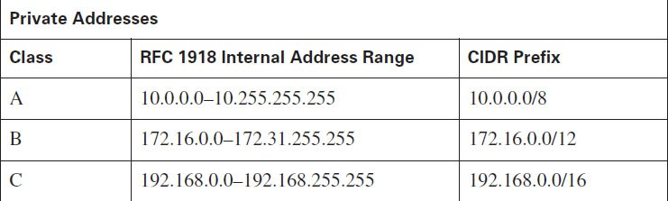
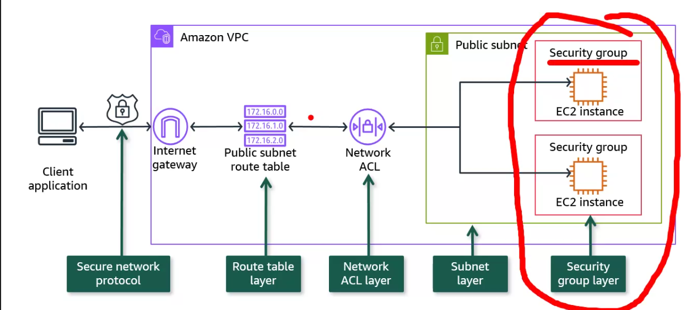
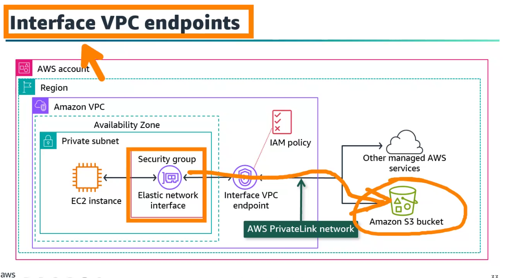
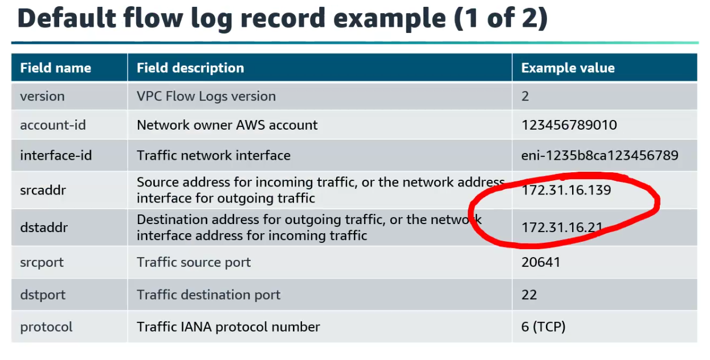
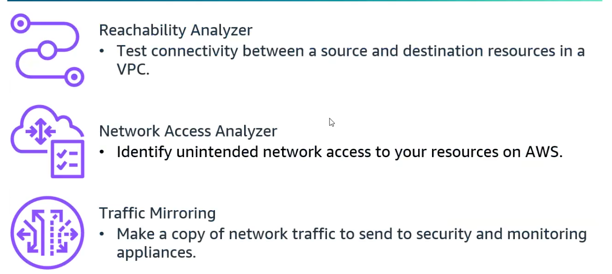

# Design e Arquitetura de Software II

[AWS Canvas](https://awsacademy.instructure.com/courses/113113)

## Repositório dos alunos
- [Repos](https://gist.github.com/901f02fd5f852b62abab10b5fb2d6328.git)

## Aula 24/02
- Well-Architect Framework
  - Excelencia operacional
  - Segurança
  - Confiabilidade (Reliabillity)
  - Eficiência em performance
  - Otimização de custos
  - Sustentabilidade

## Aula 27/02
- Trade-Offs
  - Escalabilidade/Elasticidade
  - Automatização auto escalabilidade
  - Infraestrutura como Código
  - Tratar os recursos como descartaveis
  - Baixo acoplamento
  - Design de serviços e não servidores
  - Escolha o banco de dados correto

## Aula 06/03
- Trade-Offs
  - Evitar ponto único de falha
  - Otimização de custo
  - Use de cache
  - Proteger sua infraestrutura
- Infraestrutura global da AWS
  - Regiões
  - Zonas de Disponibilidade
  - Local Zones
  - Data Centers

## Aula 10/03
- Infraestrutura global da AWS
  - POPs - Edge Location
- Segurança
  - Modelo de responsabilidade compartilhado
  - Autenticação
  - Autorização
  - Princípio do privilégio mínimo
  - Criptografia

## Aula 13/03
- Modelo de responsabilidade compartilhada
- Princípio do privilégio mínimo
- Autenticação
- Autorização
- Identity and Access Management
- Usuários
- Acesso pela console / acesso programático

## Aula 17/03
- Policy de Identidade
- Policy de Recurso
- S3

## Aula 24/03
- S3 - Gerenciamento de ciclo de vida
- S3 - Versionamento
- S3 - CORS

```bash
[
    {
        "AllowedHeaders": [
            "*"
        ],
        "AllowedMethods": [
            "GET",
            "PUT",
            "POST",
            "DELETE"
        ],
        "AllowedOrigins": [
            "http://127.0.0.1:5500"
        ],
        "ExposeHeaders": [
            "x-amz-server-side-encryption",
            "x-amz-request-id",
            "x-amz-id-2"
        ],
        "MaxAgeSeconds": 3000
    }
]
```

## Aula 27/03
- Códigos S3

## Aula 31/03
- Códigos S3

## Aula 03/04
- Computing (EC2)
- EBS
- AMI

## Aula 07/04
- Placement (Cluster/Spread/Partition)
- EC2 Purchase model (on-demand/reserved/savings plans/spot)

## Aula 10/04
- RDS
- Bancos de dados relacionais
- Bancos de dados não relacionais


## Aula 05/05

- Amazon VPC (Virtual Private Cloud)

Como definir uma rede, sem tocar na rede?

Usamos Software Defined Network -> SDN


### Introdução ao Amazon VPC

O Amazon Virtual Private Cloud (VPC) permite que você provisione uma seção isolada da nuvem AWS onde pode lançar recursos da AWS em uma rede virtual que você define. Ele oferece controle total sobre o ambiente de rede, incluindo seleção de intervalos de IP, criação de sub-redes e configuração de tabelas de roteamento e gateways de rede.

#### Componentes Principais do VPC

1. **Sub-redes:**
  - Dividem o VPC em segmentos menores.
  - Podem ser públicas (acessíveis pela internet) ou privadas (restritas a uma rede interna).

2. **Internet Gateway (IGW):**
  - Permite que instâncias em sub-redes públicas se comuniquem com a internet.

3. **NAT Gateway:**
  - Permite que instâncias em sub-redes privadas acessem a internet sem serem diretamente acessíveis.

4. **Tabelas de Roteamento:**
  - Definem como o tráfego é roteado dentro do VPC e para fora dele.

5. **Security Groups e Network ACLs:**
  - Controlam o tráfego de entrada e saída para instâncias e sub-redes.

#### Benefícios do Amazon VPC

- **Isolamento:** Recursos são isolados em uma rede virtual privada.
- **Segurança:** Controle granular sobre o tráfego de rede.
- **Flexibilidade:** Personalização de configurações de rede para atender às necessidades específicas.
- **Conectividade Híbrida:** Integração com redes locais usando VPN ou AWS Direct Connect.

#### Casos de Uso

- Hospedagem de aplicativos web em sub-redes públicas com bancos de dados em sub-redes privadas.
- Configuração de ambientes híbridos conectando redes locais ao VPC.
- Implementação de arquiteturas de microserviços com controle de tráfego entre serviços.

#### Boas Práticas

- Use múltiplas zonas de disponibilidade (AZs) para alta disponibilidade.
- Configure sub-redes privadas para recursos sensíveis.
- Habilite logs do VPC Flow para monitorar o tráfego de rede.
- Utilize Security Groups e Network ACLs para reforçar a segurança.


1. Primeiro nivel de isolamento: Conta
2. Segundo nivel: VPC
- Dentro da AWS temos as regiões.
- No Brasil temos SA-east-1
- No EUA us-east-1
Ou seja, o que está dentro de uma região, não conversa com outra região, a não ser que você queira.
Uma região é composta por varias AZs.
Tudo que está dentro de uma região é interconectado.
Uma AZ pode estar até 100 milhas de distância.

Há limite de datacenters por AZ?
Não temos como saber.

Uma AZ pode ter pelo menos 1 datacenter.
Uma região tem varias AZs, e em cada AZ pelo menos 1 datacenter.

Dica prova de certificação AWS:
Toda vez que você cria uma rede, ela fica dentro de uma região.
Cria uma rede pro servidor de minecraft no Brasil.
Agora quero pegar esse servidor e rodar no EUA, tenho que criar outra rede.
Elas não se comunicam a não ser que voc~e queira.

Uma VPC se espalha para dentro de uma região.
Se uma região tiver varios data centers e espalhados, a VPC se comunica entre todos eles, pos estão na mesma VPC.

### Amazon VPC:
1. Rede definida por software
2. Logicamente Isolada
3. Voocê customiza o trafego, quem fala com quem.
4. Tem que definir o tamanho da sua rede por CIDR

IPV4 formado por 4 octais
Cada octeto vai de 0-255
Representado por 2^8? confirmar

cidr.xyz

10.0.0.0/16

255.255.0.0

Endereço da Rede / Endereço do Host



Gerenciar tantos IPs é dificil, por isso segregamos a rede, comummente chamados de VLAN.

Na AWS isso é chamado de Subnet.
Ela é semelhante a VPC, mas um pouco diferente.
Ela é um pedacinho da VPC.
A subnet tem que estar contida na VPC.

o CIDR da subnet não pode bater no CIDR de outra subnet.
Ex: Não pode ter duas subnet com 10.1.128.0/24.


No Unifi por exemplo, tenho isolamento de cliente, mesmo se o cliente está conectado na mesma SSID, ele não se consegue comunicar com outro.

Na AWS é usado a **Tabela de rotas**.


A tabela de rotas da AWS (Route Table) é um componente fundamental dentro de uma VPC (Virtual Private Cloud). Ela define como o tráfego de rede é direcionado dentro da VPC e para fora dela.

### Conceitos principais

- **Associação com Subnets:** Cada subnet em uma VPC está associada a uma tabela de rotas. Isso determina como o tráfego de saída da subnet será roteado.
- **Rotas:** Cada entrada na tabela especifica um destino (CIDR) e um alvo (target), como um gateway de internet, NAT, ou outra interface de rede.

### Funcionamento

- Quando um pacote sai de uma instância, a AWS verifica a tabela de rotas associada à subnet para decidir para onde enviar o pacote.
- Exemplo de rotas comuns:
  - `10.0.0.0/16` → local (tráfego interno da VPC)
  - `0.0.0.0/0` → igw-xxxxxxx (Internet Gateway, para acesso à internet)
  - `0.0.0.0/0` → nat-xxxxxxx (NAT Gateway, para acesso à internet privado)

### Resumindo

A tabela de rotas controla para onde vai o tráfego de rede de cada subnet. Ela é essencial para isolar, conectar ou expor recursos na AWS.

Se quiser um exemplo prático de configuração, posso mostrar!

A AWS dá um IP para uma aplicação e reserva ela com através do MAC Address.

Subnet vivem dentro de um datacenter.
Quando criamos uma subnet, dizemos que essa maquina fica nesse lugar do mundo.

### Public subnet
Na imagem há duas cores, um azul claro e verde claro.
Na AWS há dois tipos de subnets.
1. Publica:
- Subnet onde os recursos onde estão dentro dela estão visiveis na internet publica, de dentro pra fora e de fora pra dentro.
Acesso ela de fora da rede.
E ela acessa a internet de fora pra dentro.

Para eu transformar uma subnet em pública, eu preciso de um **Internet Gateway** associado a sua VPC.

Depois, você precisa, na **Tabela de Rotas** vigente para sua subnet, adicionar uma regra de saída apontando para o **Internet Gateway**. Isso garante que o tráfego destinado à internet seja roteado corretamente para fora da VPC.

Exemplo de rota para tornar a subnet pública:

| Destino      | Target         |
|--------------|---------------|
| 0.0.0.0/0    | igw-xxxxxxxx   |

- **0.0.0.0/0**: representa todo o tráfego externo (internet).
- **igw-xxxxxxxx**: é o identificador do seu Internet Gateway.

Sem essa configuração, mesmo com o Internet Gateway associado à VPC, as instâncias na subnet não terão acesso à internet.

E a máquina precisa te rum IP Público associado.

**Internet Gateway** faz um NAT

Eu posso associar um IP publico a máquina, mas a máquina só enxerga o IP Privado, pois quem gerencia o publico é a **Internet Gateway**.


2. Privada:


## Aula 08 05

IPs publicos são pagos
Só pode ter 5 IPs publicos por região, se precisar de mais, tem ue pedir pra AWS.
IPv6 não é pago, só IPv4

### Private Subnets
- Ela não chega na internet e a internet não chega nela
- ela não consegue acessar nem mesmo serviós da AWS, s3, etc
- Num lugar desse que vamos subir um DB, File Share, Kafka
- Não enxerga pois não tem a regra de saida para o Internet Gateway e sem IP publico também

#### NAT
- Traduz o endereço ip privado para publico e vice versa

**Como a maquina está isolada da internet, como ela vai se atualizar?**
Não vai!

Teria que ter uma maquina publica e conectar na privada e copiar manualmente os arquivos pra ela

Como eu permito que as maquina que estão numa subnet privada e eu preciso baixar um pacote do SQL server, mas eu quero que a conexão só ocorra de dentro pra fora, nunca o contrario.?

Eu coloco um nat gateway, ele é um nat atras de outro nat
eu digo que quem etá na nat privada quiser sair pra internet, eu mando ela pedir pro nat gatewaym, forçado pela tabela de roteamento.

Se alguém tentar conectar na maquina da subnet privada, não consegue, porque quem tem ip publico é o NAT Gateway, que dropa se o pacote tenta entrar.

Cobra por hora de execução e por uso.

db: privado

processamento bet/lote: privado

aplicação web: publico/privado

nat gateway: publico


### Tenha segurança em varias camadas



1. Segurity Group
   1. Quem eu peço pra abrir as portas
   2. Taggeia os pacotes de rede
   3. Se criei regra de inbound, ele cria de outbound automatico
   4. Firewall Stateful: lembra dos pacote que passaram por ele
2. Network ACL (Access list)
   1. Firewall no escopo da VPC
   2. Firewall stateless
   3. porta efemera: acima do 1024
   4. Se eu liberar a de entrada, tenho que liberar a de saida também, manualmente
3. Network Firewall
   1. Servidor de firewall que podemos subir numa subnet especial pra isso
   2. Nele conseguimos controlar as regras de entrada de saida pra internet

Jump Box/bastion Hosts

Da maquina exposta na intenet eu conecto na sem internet por segurança.

Pra uma ec2 conectar num s3, precisa ser acessado pela internet publica, pois é um sesrviço gerenciado pela AWS.

pra conectar pela rede interna, nos conseguimos dar um ip privado, com o VPC Endpoint, há dois tipos



1. interface vpc endpoint: cria uma placa de rede virtual e cria um tunel que conecta com o sesrviço da aws e conecta no s3 por um ip privado e não passaria por um nat gateway.
  ele é pago, cobra por hora e dados processados

Há uma opção de graça:
2. Gateway vpc endpoint:
   1. ele só se conecta com o s3 e dynamo db
   2. O interface conecta a qualquer serviço da aws.
   3. Posui banda ilimitada
   4. é redundante
   
### LOAD BALANCER
balanceia a carga entre maquinas/serviços

### gateway load balancer
Vamos dizer que eu não quero usar o serviço da aws, que eu compro um software de terceiro, eu instalo ele numa ec2, coloco o gateway load balancer exposto pra internet e o que bater nele, manda pro software
Complicado de usar

### logs
Ferramentas de depuração de rede.
#### VPC flow logs
Isso não é um TCPDump nem um Wireshark, ele é uma interface de rede em modo promiscuo que fica ouvindo pacotes, é um log de tentativa de conexão.


Ferramentas mais modernas:


Traffic Mirroring ouve o trafeco TCP dentro da rede.


# Aula 19/05

VPC Peering
Conecta duas VPCs privadas diretamente, sem passar pela internet

Comunicação é feita por meio de IPs privados

É possível conectar VPCs em contas diferentes (com permissão)

Tráfego é roteado internamente pela rede da AWS

Baixa latência e sem custo adicional por hora, apenas pelo tráfego

Limitação: não permite transitar tráfego entre VPCs (transitive peering não é suportado)

AWS VPN Site-to-Site
Conecta a rede local (on-premises) com a VPC da AWS usando túneis IPsec

Usa a internet pública como meio de transporte

Mais barato que o Direct Connect

Pode ter variação de latência

Ideal para quem precisa de uma solução rápida e segura de conexão

Requer configuração de um Customer Gateway e um Virtual Private Gateway

Exemplo de uso:
Escritório central precisa acessar recursos em uma VPC na AWS

Tráfego passa por um túnel criptografado sobre a internet

AWS Direct Connect
Conexão física dedicada entre o datacenter local e a AWS

Alta largura de banda, baixa latência e mais segurança

Não passa pela internet

Pode ser integrado com o Virtual Interface (VIF) para acessar VPC ou serviços da AWS

Cobrado por hora + volume de dados trafegados

Ideal para cargas críticas ou uso intenso de rede

Benefícios:
Melhor performance que VPN

Consistência de latência

Alta disponibilidade com redundância

Aula 26/05

IAM Groups
Agrupam usuários com permissões semelhantes

Permissões são atribuídas aos grupos por meio de políticas

Usuários herdam as permissões do grupo

Boa prática: não dar permissão diretamente ao usuário, mas sim via grupo

Exemplo de grupos: Admins, DevOps, Finance, Leitura-S3

Roles - AWS STS
Roles (funções) são permissões temporárias atribuídas a identidades (usuários, serviços ou contas)

Muito usada para delegar acesso entre contas, serviços ou usuários externos

STS (Security Token Service) permite gerar tokens temporários de acesso

Exemplo: uma aplicação EC2 assume uma role com permissão para acessar o S3

Roles não são associadas a um usuário específico, ao contrário dos grupos

Benefícios:
Maior segurança (tempo limitado)

Boa prática em ambientes multi-conta ou com recursos temporários

AWS Cognito
Serviço gerenciado de autenticação, autorização e gerenciamento de usuários

Substitui a necessidade de criar seu próprio sistema de login

Pode autenticar com:

Provedores sociais (Google, Facebook, Apple)

Diretórios corporativos (SAML, AD)

Login direto com e-mail/senha (user pool)

Integra-se com IAM Roles para dar acesso a serviços AWS

Dois componentes principais:

User Pools: banco de usuários com autenticação e recuperação de senha

Identity Pools: gera credenciais temporárias da AWS para o usuário autenticado

Exemplo de uso:
App mobile autentica no Cognito (User Pool)

Cognito valida o usuário e fornece token

Token é usado para acessar recursos da AWS via IAM Role (com STS)


Aula 29/05

AWS Cognito  
Serviço gerenciado de autenticação, autorização e gerenciamento de identidade

Evita a necessidade de criar um sistema de login do zero

Permite autenticação com:

- Provedores sociais (Google, Facebook, Apple)
- Diretórios corporativos (SAML, Active Directory)
- E-mail e senha (User Pool próprio)

Integração com IAM para controle de acesso aos recursos da AWS

Dois componentes principais:

**User Pools**  
Banco de usuários gerenciado pela AWS  
- Responsável pela autenticação (login, registro, recuperação de senha)  
- Suporte a MFA, verificação de e-mail e telefone  
- Gera tokens (JWT) para o usuário autenticado

**Identity Pools**  
- Converte identidade autenticada em credenciais temporárias da AWS (via STS)  
- Permite acessar serviços AWS com permissões específicas  
- Associa usuários a IAM Roles com base em grupos ou atributos

Exemplo de uso:  
1. App web faz login pelo Cognito (User Pool)  
2. Cognito valida as credenciais e retorna token JWT  
3. Token é usado para obter credenciais temporárias no Identity Pool  
4. App acessa recursos AWS (ex: S3, DynamoDB) usando a Role atribuída

Benefícios:
- Escalável e seguro
- Reduz complexidade de autenticação/autorização
- Integração fácil com aplicações web e mobile

AWS Control Tower  
Serviço para configurar e gerenciar um ambiente multi-conta seguro na AWS

Cria uma **landing zone** com boas práticas já aplicadas

Ideal para organizações que precisam gerenciar várias contas com governança centralizada

Funcionalidades principais:

- Criação automatizada de contas com padrões de segurança
- Organização das contas em unidades (OUs – Organizational Units)
- Aplicação de **guardrails** (regras de segurança e conformidade)
- Integração com AWS Organizations, AWS SSO e CloudTrail

Componentes:

**Landing Zone**  
Ambiente inicial com múltiplas contas (ex: root, log, auditoria)  
- Pré-configurado com segurança, rede e monitoramento

**Guardrails**  
- Políticas pré-definidas que aplicam restrições ou monitoramento  
- Tipos: Preventivos (bloqueiam ações) e Detectivos (auditam comportamentos)

**Account Factory**  
- Ferramenta para criar novas contas com configurações padronizadas  
- Usa Service Catalog para facilitar o provisionamento

Benefícios:
- Governança centralizada em ambientes complexos
- Conformidade automática com políticas da organização
- Escalabilidade: fácil criar e gerenciar novas contas com segurança padronizada

Exemplo de uso:
1. Organização quer separar contas por time (ex: Dev, Prod, Finanças)
2. Control Tower cria contas com guardrails específicos para cada OU
3. Equipes usam suas contas de forma isolada, com segurança e compliance garantidos
